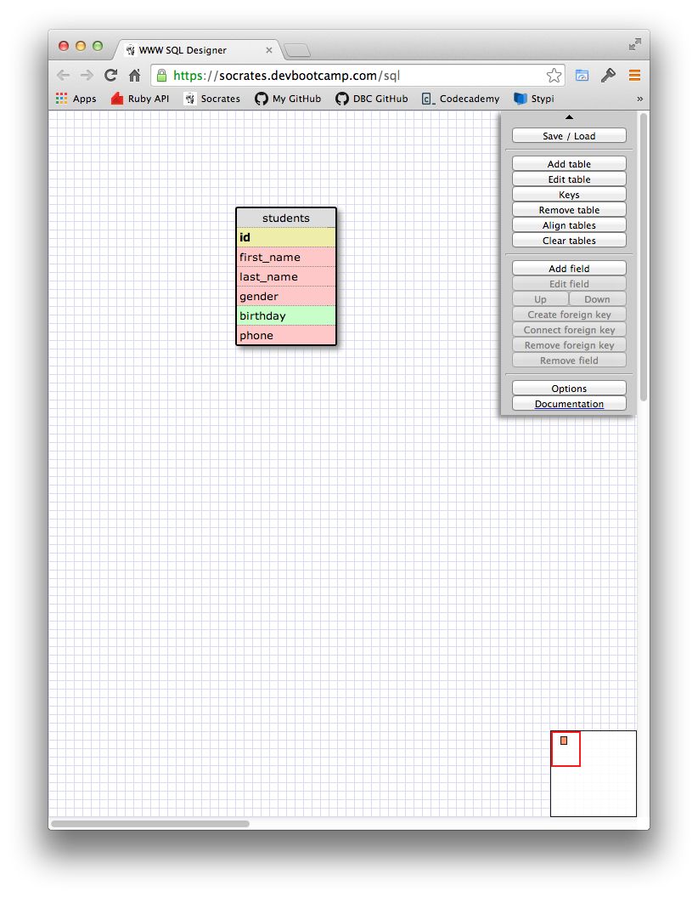
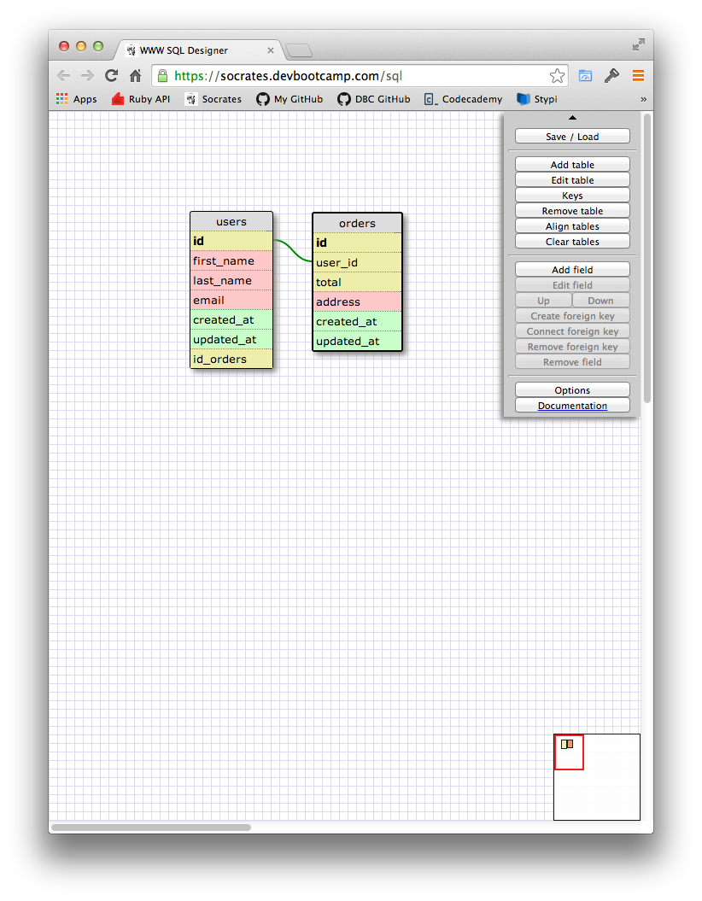
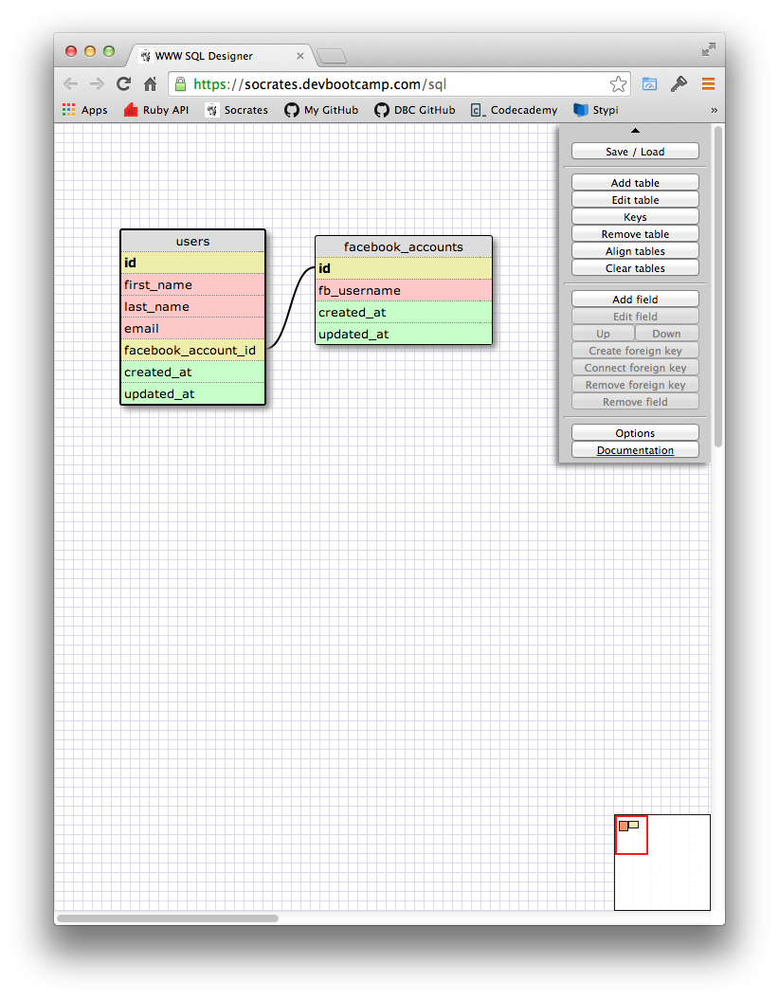
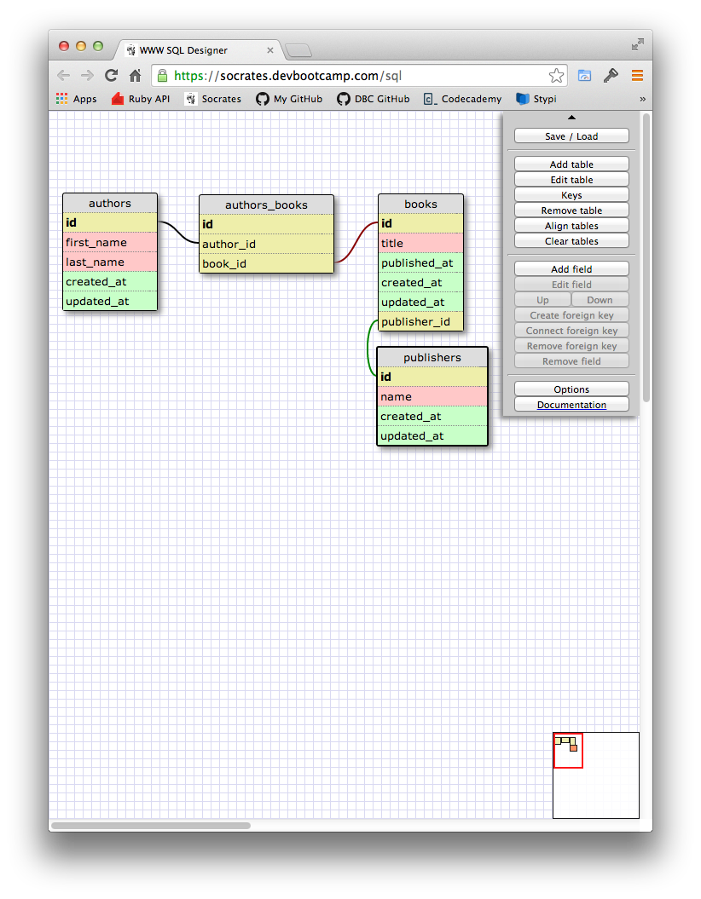
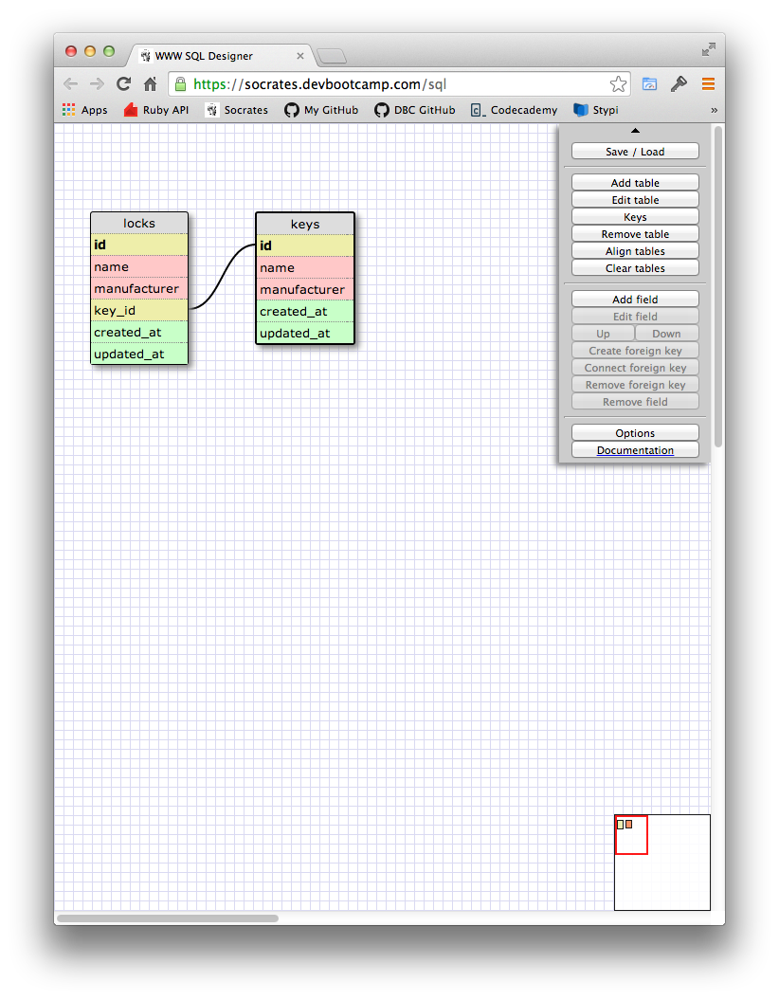
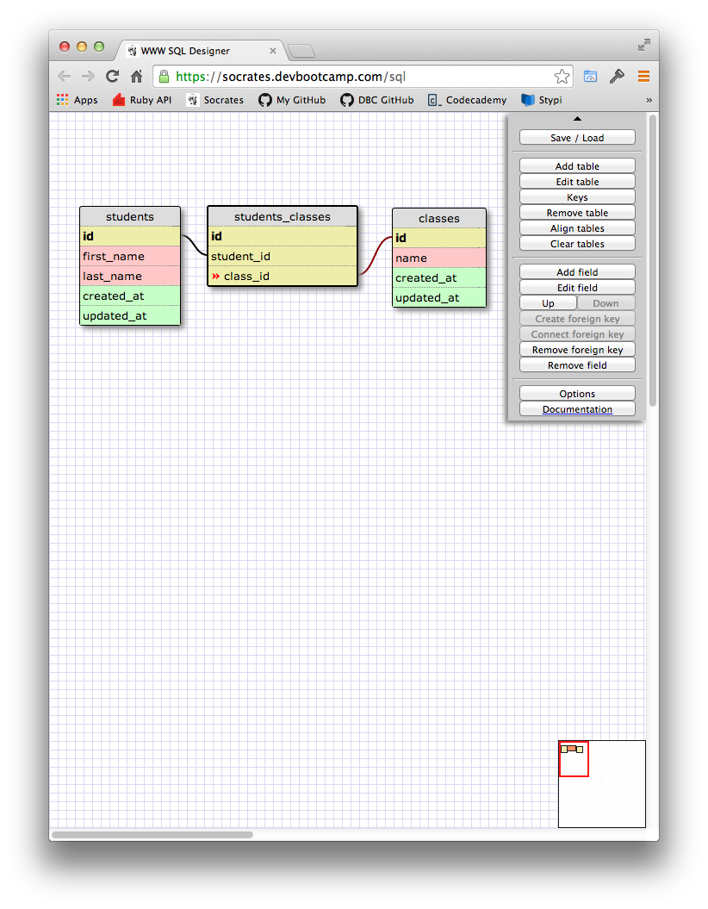

# U3.W7: Designing Schemas

#### I worked on this challenge by myself

## Release 0: Student Roster Schema

## Release 1: One to Many Schema

## Release 2: One to One Schema

## Release 3: Many to Many Schema

## Release 4: Design your own Schema
Description of what you're modeling: My one-to-one model shows the relationship between a lock and a key. This is a one-to-one relationship because each key only has one lock for which it can be used, and each lock has only one key which will unlock it.

My many-to-many model shows the relationship between a student and a class. This is a many-to-many relationship because each student may have multiple classes and each class may have multiple students.

## Release 5: Reflection

This exercise definitely forced me think in a whole new way. I'm still having a hard time conceptualizing the idea of one-to-one and many-to-many relationships. I think I've got a pretty good grasp of one-to-many, though. Creating the schemas helped to organize the relationships, and to figure out how unique keys and foreign keys relate to one another.

