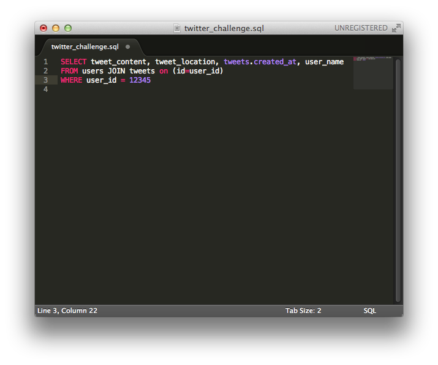
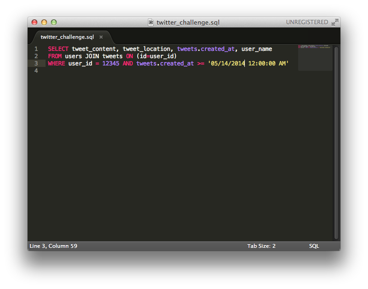
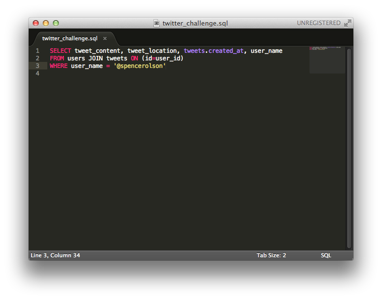
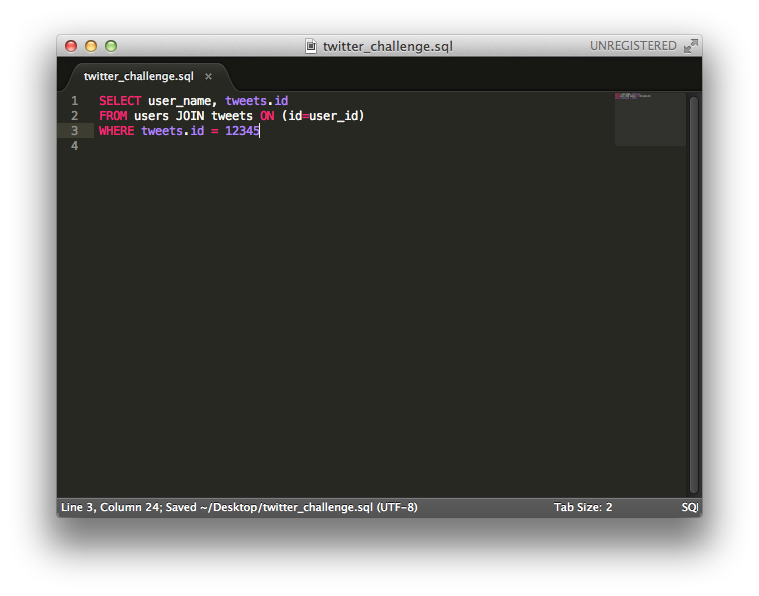

# U3.W7: Modeling a Real-World Database (SOLO CHALLENGE)

## Release 0: Users Fields
User fields Twitter collects:

1. number_of_tweets (integer)
2. number_following (integer)
3. number_followers (integer)
4. actual_name (string)
5. user_name (string)
6. location (string)
7. created_at (DateTime)
8. updated_at (DateTime)

## Release 1: Tweet Fields
Fields Twitter uses to represent/display a tweet:

1. tweet_location (string)
2. tweet_content (string)
3. created_at (DateTime)
4. updated_at (DateTime)

## Release 2: Explain the relationship
The relationship between `users` and `tweets` is: One-to-Many because each user can have many tweets, but each tweet is associated with only one user.

## Release 3: Schema Design

## Release 4: SQL Statements
<!-- Include your SQL Statements. How can you make markdown files show blocks of code? -->

* All the tweets for a certain user id

* The tweets for a certain user id that were made after last Wednesday (whenever last Wednesday was for you)

* All the tweets associated with a given user's twitter handle

* The twitter handle associated with a given tweet id

## Release 5: Reflection
<!-- Be sure to add your reflection here!!! -->