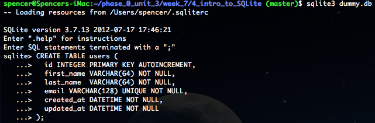
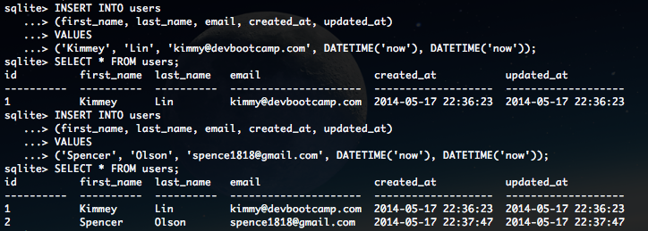
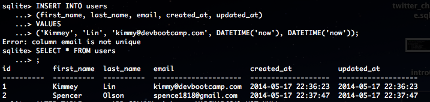
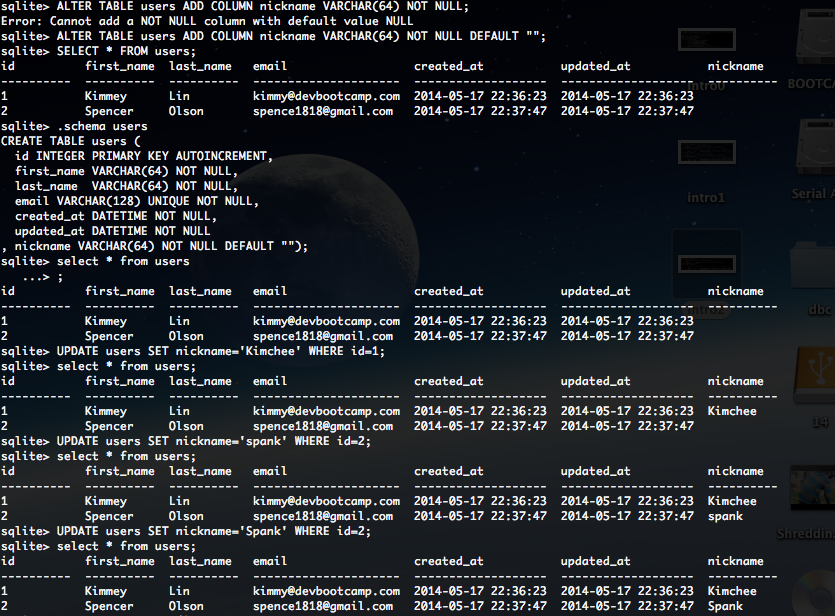
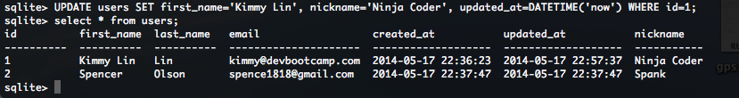

# U3.W7: Intro to SQLite

## Release 0: Create a dummy database

## Release 1: Insert Data 

## Release 2: Multi-line commands

## Release 3: Add a column

## Release 4: Change a value

## Release 5: Reflect

Using SQL is totally new to me, so this challenge was a bit scary for me, but I got through it! I really just need to familiarize myself with the syntax, which will take lots and lots of practice. It definitely helped to be able to run the SELECT * FROM users to check-up on myself as I worked through each step. I was having trouble with Release 3, when creating the nickname column. It took me a while to figure out that I needed to set a default value for the nickname column, since the value cannot be NIL. I fixed this issue by setting the default value to "" for nickname.